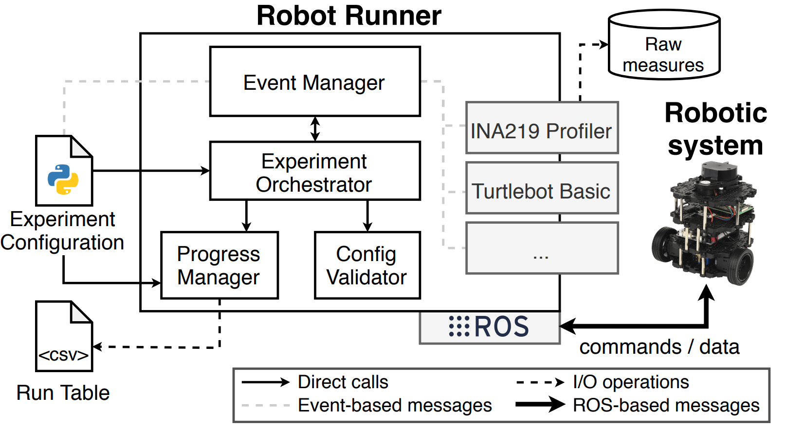

# Robot-Runner
Robot Runner (RR) is a tool to automatically execute measurement-based experiments on robotics software.

The following scientific paper gives an overview about the main components, plugins, and configurations of Robot Runner (please, consider the paper as **confidential**): [Robot Runner ICSE 2021 submission](https://github.com/S2-group/robot-runner/tree/master/documentation). 

A short video, giving a brief explanation of Robot Runner, can be seen here: [YouTube Video](https://www.youtube.com/watch?v=le-SAXI2k1E&feature=youtu.be)

In this README, the necessary steps to start using Robot Runner are detailed.

As visualized below, Robot Runner consists of the following components:
- **Experiment orchestrator**: Is in charge of executing the whole experiment according to the experiment configuration provided by the user.
- **Event manager**: Provides the user with subscribable events, to which callback methods can be set, which are called at the appropriate time by the Experiment Orchestrator.
- **Progress manager**: Keeps track of the execution of each run of the experiment.
- **Config Validator**: Provides a validation of a user's configuration file and checks system readiness.

<p align="center">

</p>

## Brief overview
Robot Runner is developed to be entirely independent from any communicational means or robotic system.
This means specifically; that Robot Runner can be used with any robotic system, or any simulation software, using any form of communication (e.g. ROS1, ROS2, TCP Sockets, etc.).

RR offers an automation of the infrastructure overhead for measurement-based, empirical, experiments as a consequence of its design, as produced by the following **design drivers**:

- **User Authority**: Give the user full aothority over the experiment execution in the Python-based configuration file.
- **Focus on Orhcestration**: Orchestrate the experiment on the basis of *events*. These events are characterized by their *moment of excecution* in any experiment.
- **Focus on Supporting Infrastructure**: Offer the user all, potentially necessary, supporting features (e.g. profiler plugins).

## Setup guide
To be able to use RR, some requirements on the system in question need to be met:
- **Python3.8**: RR is specifically tested with Python 3.8
- **Python3.8 pip packages**: The following pip packages need to be installed on the system (**psutil**, **tabulate**)
- **Multiprocessing**: The Python3.8 module *multiprocessing* needs to be supported by the system. It is found that a bug in this library prevents RR from running successfully on **macOS**.

The user's system is ready to run RR if the abovementioned requirements are met.
However, for the communication with a robotic system such means will need to be installed.
As mentioned before, the user is entirely free in this choice as RR is independent from this.

However, as the Robotic Operating System (ROS) is the de-facto standard for robotics software, it was used during development in combination with a ROBOTIS TurtleBot3 ([Burger](https://emanual.robotis.com/docs/en/platform/turtlebot3/overview/)).

For the installation of ROS, any version can be used. But during development, **ROS2 Foxy** and **ROS1 Melodic** were explicitly used.

## Quick start
Now that the system has all the necessary components installed to run Robot Runner, and has robotic enabling software installed (such as ROS), a quick start with Robot Runner can be performed.

### Creating configuration file
```bash
Python3.8 robot-runner/ config-create [directory]
```

When running this command, where *[directory]* is an optional argument, a new config file with some example code will be generated. The default location for this would be *robot-runner/experiments/*, otherwise the given directory will be used.

### Setting up an experiment
Now that a new configuration file is available, the user can define the experiment.
An experiment configuration can be defined using the provided experiment parameters and events.

**The parameters**
```python
    name:                       str             = "mini_test"
    required_ros_version:       int             = 2
    required_ros_distro:        str             = "foxy"
    operation_type:             OperationType   = OperationType.AUTO
    time_between_runs_in_ms:    int             = 1000
    results_output_path:        Path             = Path("~/Documents/experiments")
```

Supporting information:
- **name**: The name of the experiment, which is the name used for the experiment output folder, which will be created in the *results_output_path*.
- **required_ros_version**: If ROS is used in the experiment, the experiment can be defined as to be dependent on that ROS version using this paramater. If ROS is not used, the value can be set to **None**.
- **required_ros_distro**: This is a further specification of the abovementioned, it therefore has the same function and can also be discard by setting it to **None**.
- **operation_type**: If set to **AUTO**, the experiment will continue with the next run (after *time_between_runs_in_ms* milliseconds) automatically without waiting for any other stimuli. If set to **SEMI**, the experiment will only continue (after waiting *time_between_runs_in_ms* milliseconds), if the callback for the event *CONTINUE* is returned.
- **time_between_runs_in_ms**: The time Robot Runner will wait after a run completes, before continuing with the orchestration. This can be essential to accommodate for cooldown periods on some systems.
- **results_output_path**: The path in which Robot Runner will create an experiment folder according to the experiment name.

**The events**
```python
    def __init__(self):
        """Executes immediately after program start, on config load"""
        EventSubscriptionController.subscribe_to_multiple_events([ 
            (RobotRunnerEvents.BEFORE_EXPERIMENT,   self.before_experiment), 
            (RobotRunnerEvents.START_RUN,           self.start_run),
            (RobotRunnerEvents.START_MEASUREMENT,   self.start_measurement),
            (RobotRunnerEvents.LAUNCH_MISSION,      self.launch_mission),
            (RobotRunnerEvents.STOP_MEASUREMENT,    self.stop_measurement),
            (RobotRunnerEvents.STOP_RUN,            self.stop_run),
            (RobotRunnerEvents.CONTINUE,            self.continue_experiment)
            (RobotRunnerEvents.POPULATE_RUN_DATA,   self.populate_run_data),
            (RobotRunnerEvents.AFTER_EXPERIMENT,    self.after_experiment)
        ])

    def create_run_table(self) -> List[Dict]:
        """Create and return the run_table here. A run_table is a List (rows) of dictionaries (columns), 
        representing each run robot-runner must perform"""
        run_table = RunTableModel(
            factors = [
                FactorModel("example_factor", ['example_treatment1', 'example_treatment2'])
            ],
            exclude_variations = [
                {"example_treatment1"},
                {"example_treatment1", "example_treatment2"}
            ],
            data_columns=["data_column1", "data_column2"]
        )
        run_table.create_experiment_run_table()
        return run_table.get_experiment_run_table()

    def before_experiment(self) -> None:
        """Perform any activity required before starting the experiment here"""

    def start_run(self, context: RobotRunnerContext) -> None:
        """Perform any activity required for starting the run here. 
        Activities before and after starting the run should also be performed here."""

    def start_measurement(self, context: RobotRunnerContext) -> None:
        """Perform any activity required to start the measurements"""

    def launch_mission(self, context: RobotRunnerContext) -> None:
        """Perform any activity interacting with the robotic
        system in question (simulated or real-life) here."""

    def stop_measurement(self, context: RobotRunnerContext) -> None:
        """Perform any activity required to stop the measurements"""

    def stop_run(self, context: RobotRunnerContext) -> None:
        """Perform any activity required for stopping the run here.
        Activities before and after stopping the run should also be performed here."""
    
    def populate_run_data(self, context: RobotRunnerContext) -> tuple:
        """Return the run data as a row for the output manager represented as a tuple"""

    def continue_experiment(self, context: RobotRunnerContext) -> None:
        """On return of this callback, Robot Runner continues with the orchestration of the experiment"""

    def after_experiment(self) -> None:
        """Perform any activity required after stopping the experiment here"""
```
### Performing the experiment
Once the experiment has been defined by the user, as business logic setup in the shown event callbacks above, the experiment can be performed by Robot Runner. To do this, the user runs the following command:
```bash
python3.8 robot-runner/ experiment_config.py
```

After which Robot Runner will:
- Validate the config
- Output the config's values as read by RR in the terminal for user validation
- Create the experiment folder
- Create the run table (.csv), and persist it in the experiment folder
- Run the experiment on a per-run basis, going over each run with its specified treatments in the run table.

### Examples
Robot Runner offer a simple example for a ROS1 based robotic system.
The experiment was performed on a ROBOTIS TurtleBot3 specifically.
The example experiment is called 'mini-mission' and can be found in the *robot-runner/experiments/mini-mission/* folder.

The mini-mission, its execution and its output is explained in the video referenced at the beginning of this README.

### Supporting Features
Robot Runner offers extensive supporting infrastructure, such as:
- **Restarting**: Robot Runner is able to restart an experiment, if the experiment was not entirely completed on the last run. Every run that is not yet performed and persisted by Robot Runner will in that case be run again and their information persisted in the experiment output folder. Robot Runner has extensive protection measures installed to prevent the accidental overwriting of an experiment or already performed runs.
- **Operational Types**: As mentioned before, Robot Runner offers the user the possibility of two operational types, which aid in a more flexible experiment design.
- **Run Table Creation Model**: In the mandatory method *create_run_table*, the RunTableModel in combination with the FactorModel's can be seen in action. The user is offered this supporting infrastructure to be able to easily define an experiment with Factors, their Treatments, exclude certain combinations of Treatments, and add data columns for storing aggregated data in the run table using the *populate_run_table* event callback.
- **ROS Dependency Requirements**: As mentioned before, Robot Runner offers the user the possibility, if ROS is used and a dependency on a certain version exists, to state it as such and make sure the experiment can only be ran if those dependencies are met.
- **Plugins**: Robot Runner offers reusable plugins across missions, which can be used to further abstract and simplify experiment configurations. For example, the *INA219Profiler* exists, which offers a comprehensive abstraction around energy related data gathered from an [INA219](https://www.ti.com/lit/ds/symlink/ina219.pdf?ts=1606371123053&ref_url=https%253A%252F%252Fwww.google.com%252F) sensor.
- **Docker**: Two dockerfiles are available at *robot-runner/docker/ros1* and *robot-runner/docker/ros2* which are created so the user can build either a ROS1 or ROS2 supporting Docker container in which robot-runner is able to run and perform missions. The dockerfiles are explicitly set up to build a *ROS1 Melodic or ROS2 Foxy* image as these were used during development. However, these versions can easily be changed by editing the dockerfile and stating any other version to be required. This would involve changing only a minor subset of one line for each of the dockerfiles. Specifically: *FROM ros:foxy* to *FROM ros:eloquent* or any other alteration involving a **correct** ROS version. **NOTE**: that the respective ROS1 and ROS2 dockerfiles are created with a purpose, as their correct setup for robot-runner to be able to run, involve different steps. Therefore only alter the ROS1 dockerfile to any other ROS1 version, and do the same for the ROS2 dockerfile.
